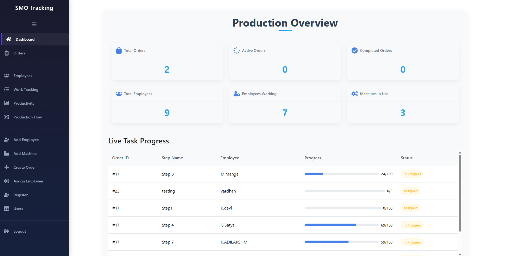
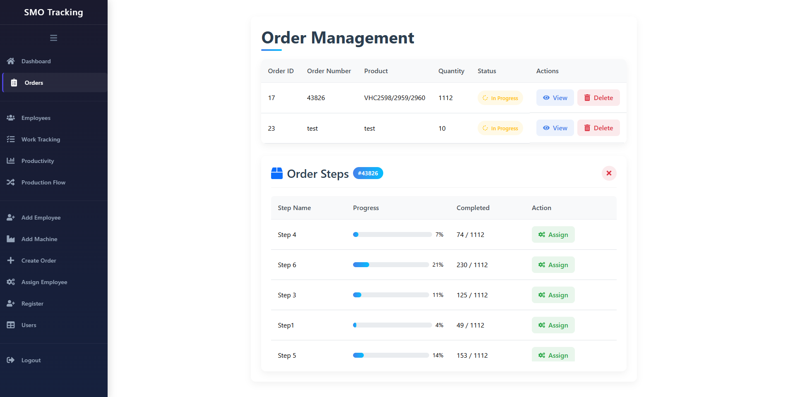

# SMO-Frontend

A comprehensive React-based frontend for a Shop Management and Order tracking system designed to manage production workflows, employee assignments, and machine allocations.

## Application Overview

This application provides a complete solution for manufacturing businesses to manage their orders, track production processes, assign employees to various tasks, and monitor productivity metrics. The user-friendly interface offers both desktop and mobile responsive views for all key functionality.

## Key Features

- **User Authentication**: Secure login and registration system
- **Order Management**: Create, view, and track orders through the production process
- **Employee Management**: Add, list, and assign employees to production tasks
- **Machine Management**: Add and allocate machines for production tasks
- **Production Tracking**: Monitor work progress and track order status
- **Dashboard Analytics**: View key production metrics and performance indicators
- **Responsive Design**: Optimized for both desktop and mobile devices

## Pages and Their Functions

### Authentication

- **Login (`/login`)**: User authentication page with email and password login
- **Register (`/register`)**: New user registration page

### Dashboard

- **Office Dashboard (`/office-dashboard`)**: Main dashboard showing production overview with key metrics including total orders, active orders, completed orders, employee status, and machine usage. Displays live task progress.

### Order Management

- **Orders (`/orders`)**: View and manage all orders, including their status and progress. Allows deleting orders and viewing order steps.

- **Create Order (`/create-order`)**: Form to create new production orders with product details and quantities.

- **Order Tracking (`/order-tracking`)**: Track the progress of specific orders through different production stages.

### Employee Management

- **Employee List (`/employees`)**: View and manage all employees in the system.

- **Add Employee (`/add-employee`)**: Form to add new employees to the system with their details and skills.

- **Assign Employee (`/assign-employee`)**: Interface to assign employees to specific production tasks.
- **Employee Productivity Graphs (`/productivity`)**: Visual analytics showing employee performance and productivity metrics.

### Machine Management

- **Add Machine (`/add-machine`)**: Form to add new machines to the inventory.
- **Assign Machine (`/assign-machine`)**: Interface to allocate machines to specific production tasks.

- **Machine Allocations (`/machine-allocations`)**: Overview of current machine assignments and availability.

### Production Management

- **Work Tracking (`/work-tracking`)**: Monitor and update progress on ongoing production tasks.

- **Production Flow (`/production-flow`)**: Visual representation of the production process workflow.

### User Management

- **Users Table (`/users`)**: Admin interface to manage system users and their permissions.

## Technical Information

This project was built with:
- React.js
- React Router for navigation
- Axios for API communication
- Bootstrap for responsive styling
- React Icons for UI elements

## Getting Started

1. Clone the repository
2. Install dependencies with `npm install`
3. Configure the API URL in the environment variables
4. Start the development server with `npm start`
